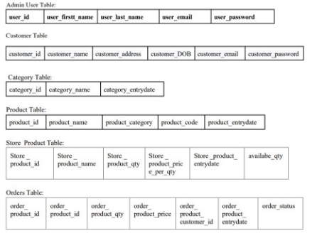

# BDShopHouse E-commerce Website

 #                                   Introduction

## Overview

The online shopping database project is an initiative to create a user-friendly e-commerce platform. It encompasses database design using SQL, secure login and sign-up inter- faces, and an efficient admin panel, catering to user convenience, business expansion, data-driven insights, and technological advancements in the rapidly growing online shopping industry. The project aims to provide a seamless shopping experience while ensuring data security and facilitating effective platform management.

The online shopping database project encompasses key components, including a secure login interface, a user-friendly sign-up interface, and an efficient admin panel. These interfaces are pivotal in ensuring user authentication and data security, simplify- ing user registration, and enabling effective platform management.


## Goals/Objectives

The design goals and objectives for the online shopping database project encompass
various aspects, including database design, user interfaces, and administrative functionalities. Here are some specific objectives along with descriptions for each topic:

- Database Design Using SQL:

  Objective: Design a robust and well-structured database using SQL to efficiently store, manage, and retrieve product information, customer data, and order details.

  Description: The database design is fundamental to the project’s success. By creating a clear, normalized, and efficient database schema, the project ensures that data integrity is maintained, and the system operates smoothly. SQL will be utilized to define tables, relationships, indexes, and constraints to optimize data storage and retrieval.

- User Login Interface:

  Objective: Develop a secure and user-friendly login interface to allow customers to authenticate themselves before accessing the platform.

 Description: The login interface is a critical component for user authentication
  and data security. It should provide a simple yet secure mechanism for users to
  log in, protecting their personal information. It will include features like username/password validation, password encryption, and potentially two-factor authentication for enhanced security.


- User Signup Interface:

  Objective: Createanintuitiveanduser-friendlysignupinterfacethatenablesnew customers to register on the platform.

  Description: The signup interface plays a pivotal role in expanding the user base. It should guide users through the registration process, collecting essential infor- mation and verifying email addresses. Security measures, such as CAPTCHA, may be incorporated to prevent automated bot registrations.

- Admin Panel Interface:

  Objective: Develop a feature-rich admin panel interface that empowers adminis- trators to manage products, monitor orders, and oversee user activities.

  Description: The admin panel interface is designed for internal stakeholders to manage the platform efficiently. It should provide tools for adding, editing, and removing products, monitoring order processing, and accessing user data. Ad- vanced functionalities might include analytics, reporting, and user management.

  These objectives represent the foundation of the project, encompassing the essen- tial components required to establish a successful online shopping platform. By focusing on database design, user interfaces, and administrative capabilities, the project aims to provide a comprehensive and secure shopping experience for both customers and platform administrators.


                 Figure 1.1: Admin Panel Interface


# Design/Development/Implementation of the Project

# Introduction

The online shopping database project is an initiative to create a user-friendly e-commerce
platform. It encompasses database design using SQL, secure login and sign-up interfaces, and an efficient admin panel, catering to user convenience, business expansion,
data-driven insights, and technological advancements in the rapidly growing online
shopping industry. The project aims to provide a seamless shopping experience while
ensuring data security and facilitating effective platform management.
The online shopping database project encompasses key components, including a
secure login interface, a user-friendly sign-up interface, and an efficient admin panel.
These interfaces are pivotal in ensuring user authentication and data security, simplifying user registration, and enabling effective platform management.

# Details


# Key Features

## The Store Management System project includes the following features:

- Administrator Interface:
- Accessible only to authorized administrators.
- Provides tools for managing products, orders, and customer information.
- Dashboard for quick insights into sales, inventory, and other key metrics. Customer Interface:
- Accessible to registered users and guests.

- Allows users to browse products, add them to the cart, and complete purchases.
- User-friendly navigation for a seamless shopping experience.
- Personalized user accounts for order history and tracking.
- User Authentication: Secure Login:
- Users (both administrators and customers) must authenticate using secure login
credentials.
- Passwords are stored securely using encryption techniques.
- Order management: Customer can create, view, and edit orders. They can also
track the status of orders.
- Sales Management: Enables recording and tracking of sales transactions, generating invoices, and calculating total sales.
- Customer Management: Allows storing and managing customer details, including contact information and purchase history.
- Reports and Analytics: Provides comprehensive reports on sales, inventory, and
customer statistics


                            Figure 2.1: Home page
 


                                   Figure 2.2: Middle Page


                                    Figure 2.3: Footer Page

# Implementation

In the implementation phase of the Online BD ShopHouse project, the primary focus was on developing a robust and user-friendly application using PHP and MySQL. PHP served as the scripting language for server-side development, while MySQL was em- ployed as the relational database management system to store and manage the project’s data.

The implementation encompassed the creation of various modules and functionalities- ties, addressing both the admin and customer sections. The following key aspects were considered during the implementation process:

## Design User Panel


Figure 2.4: User Registration

## User Login:


Figure 2.5: User Login

## Admin Panel:


1) Admin Login Panel - Sign In


2) Admin Login Panel - Login

![ref1]

3) Admin Login Panel - Footer


(a) Admin Login Panel - Footer

Figure 2.8: Customer Dashboard

2. Database<a name="_page15_x89.86_y449.71"></a> Schemas



Figure 2.9: Database Schema Diagram


Figure 2.10: Database Table Design

3. Implement<a name="_page16_x89.86_y474.17"></a> Backend Code


Figure 2.11: Database Table Design

Created all tables according to this project schema. And connect the database with HTML and PHP files.


Performance Evaluation

1. Simulation<a name="_page17_x89.86_y265.32"></a> Environment/ Simulation Procedure

The simulation environment was developed using php programming language, boot- strap and mysql. The environment provides a user-friendly interface for this project. The development environment used for this project includes:

- Install a web server: Set up a local web server environment such as XAMPP or WAMP, which includes Apache, PHP, and MySQL.
- Database creation: Create a new MySQL database to store the simulated data for the Online BD ShopHouse.

Device

- Brand: MSI
- Model Name: Desktop-584678
- Screen Size: 18 Inches
- Colour: Multiple color
- Hard Disk Size: 256 GB
- CPU Model: Core i5 8250U
- RAM Memory Installed Size: 12 GB
- Operating System: Windows 10 Pro
- Special Feature: Thin
- Graphics Card Description: Integrated


# Results Analysis and Discussions

In the result analysis and discussion, the obtained simulation outcomes are scrutinized
and interpreted, shedding light on the implications for the system or process under study.

# Admin Panel

Admin All Section

![ref2]

1) Admin Login Panel - Admin


2) Admin Login Panel - Mapping


3) Admin Login Panel - Mapping


4) Admin Login Panel - Mapping

Figure 3.1: Admin Panel

Product

![ref2]

1) Admin Login Panel - Product Add

![ref1]

2) Admin Login Panel - Product List

Figure 3.2: Admin Panel

Order

![ref1]

1) Admin Login Panel - Pending Order

![ref2]

2) Admin Login Panel - Admin List

                                  Figure 3.3: Admin Panel

2. Customer<a name="_page22_x89.86_y178.41"></a> Panel


1) Customer Panel - Checkout


2) Customer Panel - Login

                      Figure 3.4: Customer Panel


# Conclusion

## Discussion

The Online BD ShopHouse project is a valuable tool for businesses that need to manage
their inventory, orders, and customers. The application is easy to use and it is highly
scalable. I am confident that the Online BD ShopHouse project will be a valuable asset
to the company

# Practical Implications

Online BD ShopHouse project has several practical implications that can positively
impact the efficiency and productivity of store operations. Some of the practical implications of implementing this project are as follows:
1. Streamlined Inventory Management
2. Improved Sales Tracking and Analysis
3. Enhanced Customer Relationship Management
4. Efficient Reporting and Decision Making
5. Time and Cost Savings
6. Enhanced Data Security
7. Scalability and Future Growth
In summary, the practical implications of the Online BD ShopHouse project include
optimized inventory management, improved sales tracking and analysis, enhanced customer relationship management, efficient reporting and decision-making, time and cost
savings, enhanced data security, and the ability to scale and support future growth.
These implications contribute to overall operational efficiency, customer satisfaction,
and business success


# References

Please Visit the Following Link For More Information:

- <https://www.w3schools.com/mysql/mysql_sql.asp>
- <https://www.w3schools.com/php/>
- <https://github.com/pan78m>


## How to run this Project
- First of all Install xampp server and import bdshop database file
- Find the server dot sql file
- First of all run the server dot java file then 
- Run user1 and user2 
- But reminder that sometimes shows some error because you need to connect any local server. Then this error do not shows next time


## You can find project proposal [.png>)](https://www.overleaf.com/read/prtykbybvqwx#2271f7)

## Code of Sources

To deploy this project run

```bash
  Messenger/src/Chat
```
```bash
  Group Chatting Application/src/group/chatting/application
```


## Social

[](https://www.youtube.com/@pan78mtricks)

[](https://www.facebook.com/pankaj.mahanto.78)

[](linkedin.com/in/pankaj-mahanto78/)

[](https://x.com/mahanto_pankaj?t=uSysV9y-QMHIzqo-PIL3sA&s=08)


## Authors

[.png>
)](https://www.github.com/pankaj-arya)

[](https://www.google.com/gmail)
# You can find project report [.png>)](https://www.overleaf.com/read/fmxgqmjkdghr#d63580)


